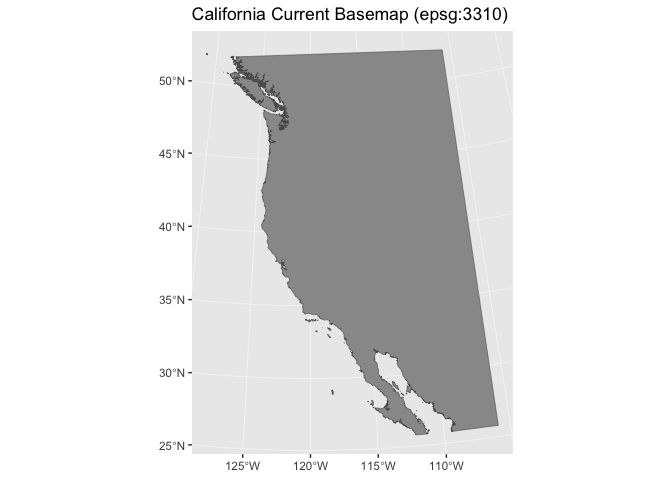
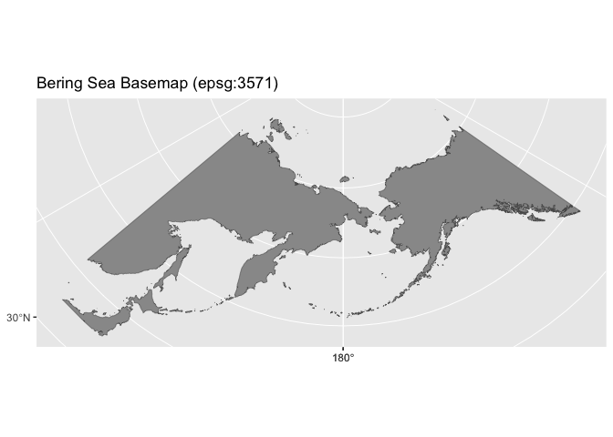
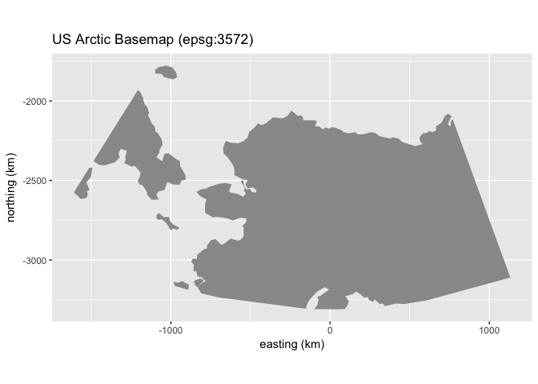
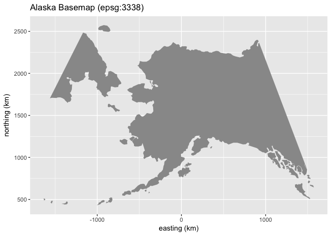
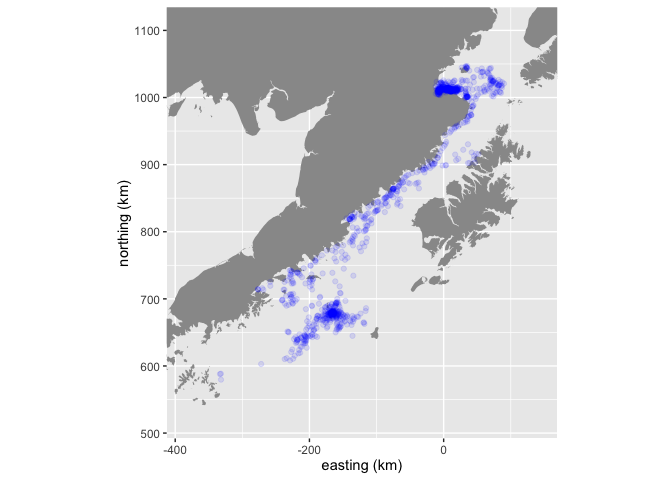

<!-- README.md is generated from README.Rmd. Please edit that file -->
nPacMaps: an R package for North Pacific basemap data
=====================================================

About
-----

Creating maps for the North Pacific can be difficult, frustrating, and confusing. The main source of this frustration is the 180 longitude line and the limited examples that exist for guidance. This R package relies on data from the [Global Self-consistent, Hierarchical, High-resolution Geography (GSHHG) Database](https://www.soest.hawaii.edu/pwessel/gshhg/).

The main objective is to provide a simple interface for quickly loading basemap polygon land data for the North Pacific Region that can be used in the ggplot2 graphical ecosystem.

This package is under active development and functionality is subject to change and improvement at anytime.

Installation
------------

The nPacMaps package is not available on CRAN and must be installed via the `devtools::install_github()` function.

``` r
install.packages("devtools")
devtools::install_github('jmlondon/npacmaps')
```

A cutting-edge 'develop' branch is also available. Proceed with caution.

``` r
install.packages("devtools")
devtools::install_github('jmlondon/npacmaps',ref='develop')
```

After successfully installing the package from GitHub, you will need to download and install the GSHGG data. This is handled via the `nPacMaps::install_gshhg()` function.

``` r
library(nPacMaps)
install_gshhg()
```

Resolution
----------

The GSHHG dataset has five different resolutions available:

1.  **f**ull resolution: Original (full) data resolution.
2.  **h**igh resolution: About 80 % reduction in size and quality.
3.  **i**ntermediate resolution: Another ~80 % reduction.
4.  **l**ow resolution: Another ~80 % reduction.
5.  **c**rude resolution: Another ~80 % reduction.

The **i**ntermediate reolustion has been set as the default option and should suffice for most applications. The default resolution can be overided via the `resolution` parameter. Users should consider bumping up to **h**igh or **f**ull when zooming into smaller scale regions. This will increase the extraction and drawing time. If you require the **f**ull resolution frequently, creating a custom region via `extract_gshhg()` should be considered.

Projections
-----------

All of the returned maps are provide with projected coordinates in a default projection chosen for each region. In most cases, the default projections are sensible and all users need to do is insure all other data is transformed to the same projection. A custom projection can be provided by specifying the corresponding epsg integer value to the `epsg` parameter.

geom\_sf for ggplot2
--------------------

By default all of the basemap objects are returned as an `sf` object. ggplot2 now offers native support for plotting `sf` objects via the `geom_sf`. The examples below demonstrate basic use of `geom_sf`.

Simplified for Improved Performance
-----------------------------------

The `rmapshaper::ms_simplify` function is applied to the returned objects by default. The function is set to return 20% of the original points and to preserve small shapes (i.e. small islands and other features). This improves performance for plotting and should suffice for most users. However, the original integrity of the GSHHG data will be changed. Any uses of `nPacMaps` for analytical purposes (e.g. calculating distance to shoreline, least-cost path creation around land) should consider whether passing `simplify=FALSE` would be more appropriate.

Additional Utility Functions
----------------------------

The package previously included two additional utility functions: `to_km()` and `ggExpansion()`. These have been deprecated.

Examples
--------

### North Pacific Basemap

``` r
library(ggplot2)
library(nPacMaps)
#> Loading required package: PBSmapping
#> 
#> -----------------------------------------------------------
#> PBS Mapping 2.70.4 -- Copyright (C) 2003-2018 Fisheries and Oceans Canada
#> 
#> PBS Mapping comes with ABSOLUTELY NO WARRANTY;
#> for details see the file COPYING.
#> This is free software, and you are welcome to redistribute
#> it under certain conditions, as outlined in the above file.
#> 
#> A complete user guide 'PBSmapping-UG.pdf' is located at 
#> /Users/josh.london/Library/R/3.4/library/PBSmapping/doc/PBSmapping-UG.pdf
#> 
#> Packaged on 2017-06-28
#> Pacific Biological Station, Nanaimo
#> 
#> All available PBS packages can be found at
#> https://github.com/pbs-software
#> 
#> To see demos, type '.PBSfigs()'.
#> -----------------------------------------------------------
#> Loading required package: maptools
#> Loading required package: sp
#> Checking rgeos availability: TRUE
library(sf)
#> Linking to GEOS 3.6.2, GDAL 2.2.3, proj.4 4.9.3

npac_base <- nPacMaps::npac()
#> importGSHHS status:
#> --> Pass 1: complete: 15611 bounding boxes within limits.
#> --> Pass 2: complete.
#> --> Clipping...
#> Warning in refocusWorld(as.PolySet(as.data.frame(xres), projection = "LL"), : Removed duplicates of following polygons (Antarctica?): 0, 1, 15
#> importGSHHS: input xlim was (0, 360) and the longitude range of the extracted data is (0, 359.532917).
#> Warning in extract_gshhg(xlims = xlims, ylims = ylims, resolution =
#> resolution, : nPacMaps now returns a polygon that has been simplified
#> via the rmapshaper package. This should improve plotting performance. Set
#> simplify = FALSE if you want to maintain the original gshhg shorelines.

npac_plot <- ggplot() + 
  geom_sf(data = npac_base,
               fill = "grey60", size = 0.2) +
  ggtitle('North Pacific Basemap (epsg:3832)')
npac_plot
```


### California Current

``` r
library(ggplot2)
library(nPacMaps)
library(sf)

calcur_base <- nPacMaps::calcur()
#> importGSHHS status:
#> --> Pass 1: complete: 4965 bounding boxes within limits.
#> --> Pass 2: complete.
#> --> Clipping...
#> Warning in refocusWorld(as.PolySet(as.data.frame(xres), projection = "LL"), : Removed duplicates of following polygons (Antarctica?): 0, 1, 15
#> importGSHHS: input xlim was (0, 360) and the longitude range of the extracted data is (0, 359.532917).
#> Warning in extract_gshhg(xlims = xlims, ylims = ylims, resolution =
#> resolution, : nPacMaps now returns a polygon that has been simplified
#> via the rmapshaper package. This should improve plotting performance. Set
#> simplify = FALSE if you want to maintain the original gshhg shorelines.

calcur_plot <- ggplot() + 
  geom_sf(data = calcur_base,
               fill = "grey60", size = 0.2) +
  ggtitle('California Current Basemap (epsg:3310)')
calcur_plot
```



### Bering Sea Basemap

``` r
library(ggplot2)
library(nPacMaps)
library(sf)

bering_base <- nPacMaps::bering()
#> importGSHHS status:
#> --> Pass 1: complete: 15491 bounding boxes within limits.
#> --> Pass 2: complete.
#> --> Clipping...
#> Warning in refocusWorld(as.PolySet(as.data.frame(xres), projection = "LL"), : Removed duplicates of following polygons (Antarctica?): 0, 1, 15
#> importGSHHS: input xlim was (0, 360) and the longitude range of the extracted data is (0, 359.532917).
#> Warning in extract_gshhg(xlims = xlims, ylims = ylims, resolution =
#> resolution, : nPacMaps now returns a polygon that has been simplified
#> via the rmapshaper package. This should improve plotting performance. Set
#> simplify = FALSE if you want to maintain the original gshhg shorelines.

bering_plot <- ggplot() + 
  geom_sf(data = bering_base,
               fill = "grey60", size = 0.2) +
  ggtitle('Bering Sea Basemap (epsg:3571)')
bering_plot
```



### US (Alaska) Arctic Basemap

``` r
library(ggplot2)
library(nPacMaps)
library(sf)

us_arctic_base <- nPacMaps::us_arctic()
#> importGSHHS status:
#> --> Pass 1: complete: 9504 bounding boxes within limits.
#> --> Pass 2: complete.
#> --> Clipping...
#> Warning in refocusWorld(as.PolySet(as.data.frame(xres), projection = "LL"), : Removed duplicates of following polygons (Antarctica?): 0
#> importGSHHS: input xlim was (0, 360) and the longitude range of the extracted data is (4.585778, 359.275833).
#> Warning in extract_gshhg(xlims = xlims, ylims = ylims, resolution =
#> resolution, : nPacMaps now returns a polygon that has been simplified
#> via the rmapshaper package. This should improve plotting performance. Set
#> simplify = FALSE if you want to maintain the original gshhg shorelines.

us_arctic_plot <- ggplot() + 
  geom_sf(data = us_arctic_base,
               fill = "grey60", size = 0.2) +
  ggtitle('US Arctic Basemap (epsg:3572)')
us_arctic_plot
```



### Alaska Basemap

``` r
library(ggplot2)
library(nPacMaps)
library(sf)

ak_base <- nPacMaps::alaska()
#> importGSHHS status:
#> --> Pass 1: complete: 11544 bounding boxes within limits.
#> --> Pass 2: complete.
#> --> Clipping...
#> Warning in refocusWorld(as.PolySet(as.data.frame(xres), projection = "LL"), : Removed duplicates of following polygons (Antarctica?): 0, 1, 15
#> importGSHHS: input xlim was (0, 360) and the longitude range of the extracted data is (0, 359.532917).
#> Warning in extract_gshhg(xlims = xlims, ylims = ylims, resolution =
#> resolution, : nPacMaps now returns a polygon that has been simplified
#> via the rmapshaper package. This should improve plotting performance. Set
#> simplify = FALSE if you want to maintain the original gshhg shorelines.

ak_plot <- ggplot() + 
  geom_sf(data = ak_base,
               fill = "grey60", size = 0.2) +
  ggtitle('Alaska Basemap (epsg:3338)')
ak_plot
```



We can also zoom in on a particular region

``` r
library(ggplot2)
library(nPacMaps)
library(crawl)
#> crawl 2.1.2 (2017-04-27) 
#>  Demos and documentation can be found at our new GitHub repository:
#>  https://dsjohnson.github.io/crawl_examples/
library(dplyr)
#> 
#> Attaching package: 'dplyr'
#> The following objects are masked from 'package:stats':
#> 
#>     filter, lag
#> The following objects are masked from 'package:base':
#> 
#>     intersect, setdiff, setequal, union
library(sf)

data("harborSeal")

harborSeal <- harborSeal %>% 
  filter(!is.na(latitude)) %>% 
  as.data.frame() %>% 
  sf::st_as_sf(coords = c("longitude","latitude")) %>% 
  sf::st_set_crs(4326) %>% 
  sf::st_transform(3338)

b <- sf::st_bbox(harborSeal)
b
#>       xmin       ymin       xmax       ymax 
#> -333349.45  579591.03   89911.47 1046814.58

ak_base <- nPacMaps::alaska(resolution = "f")
#> you requested either 'full' or 'high' resolution GSHHS data. It make take a few minutes to create your object
#> importGSHHS status:
#> --> Pass 1: complete: 6834 bounding boxes within limits.
#> --> Pass 2: complete.
#> --> Clipping...
#> importGSHHS: input xlim was (175, 230) and the longitude range of the extracted data is (175, 230).
#> Warning in extract_gshhg(xlims = xlims, ylims = ylims, resolution =
#> resolution, : nPacMaps now returns a polygon that has been simplified
#> via the rmapshaper package. This should improve plotting performance. Set
#> simplify = FALSE if you want to maintain the original gshhg shorelines.

ak_plot <- ggplot() + 
  geom_sf(data = ak_base,
               fill = "grey60", size = 0.2) +
  geom_sf(data = harborSeal,
             alpha = 0.1, color = 'blue') +
  coord_sf(xlim = c(b["xmin"], b["xmax"]), ylim = c(b["ymin"], b["ymax"]))
ak_plot
```



------------------------------------------------------------------------

##### Disclaimer

<sub>This repository is a scientific product and is not official communication of the Alaska Fisheries Science Center, the National Oceanic and Atmospheric Administration, or the United States Department of Commerce. All AFSC Marine Mammal Laboratory (AFSC-MML) GitHub project code is provided on an ‘as is’ basis and the user assumes responsibility for its use. AFSC-MML has relinquished control of the information and no longer has responsibility to protect the integrity, confidentiality, or availability of the information. Any claims against the Department of Commerce or Department of Commerce bureaus stemming from the use of this GitHub project will be governed by all applicable Federal law. Any reference to specific commercial products, processes, or services by service mark, trademark, manufacturer, or otherwise, does not constitute or imply their endorsement, recommendation or favoring by the Department of Commerce. The Department of Commerce seal and logo, or the seal and logo of a DOC bureau, shall not be used in any manner to imply endorsement of any commercial product or activity by DOC or the United States Government.</sub>
